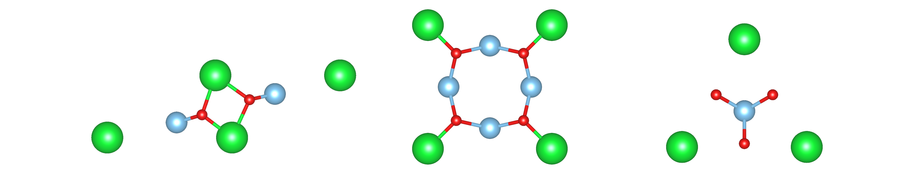
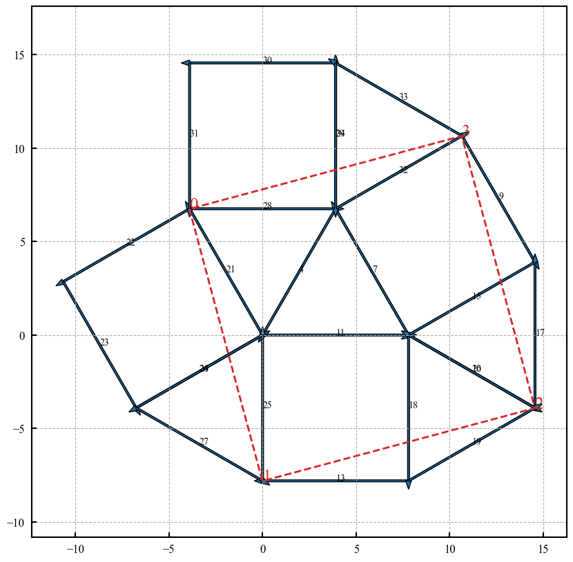
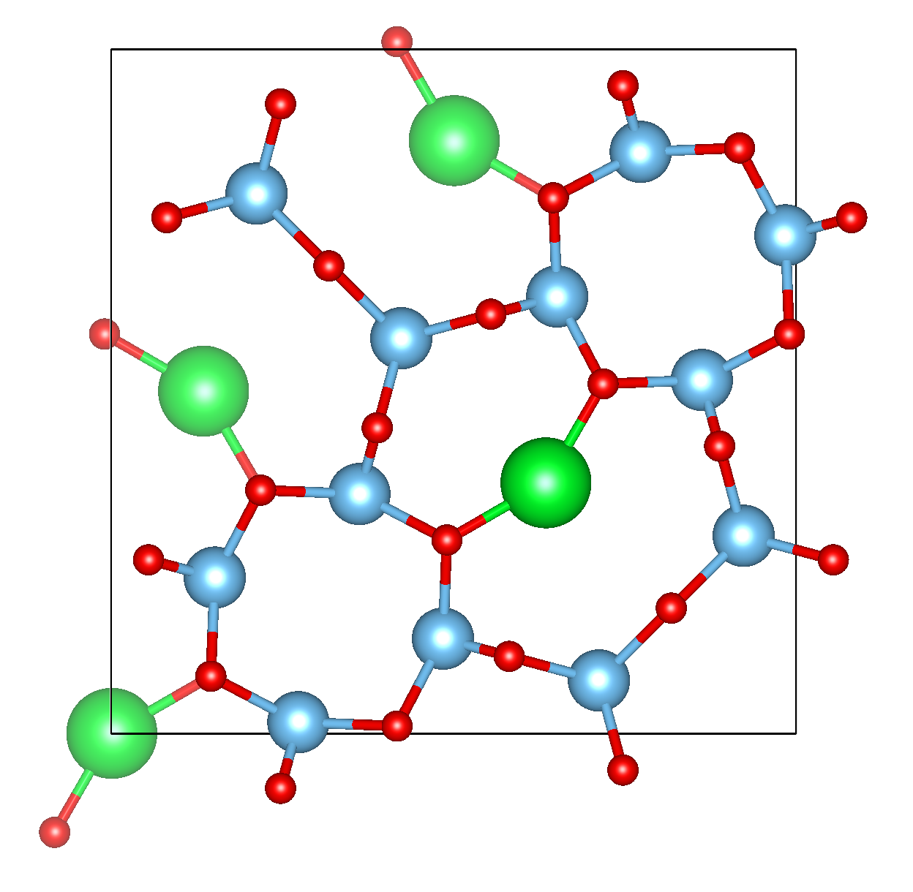
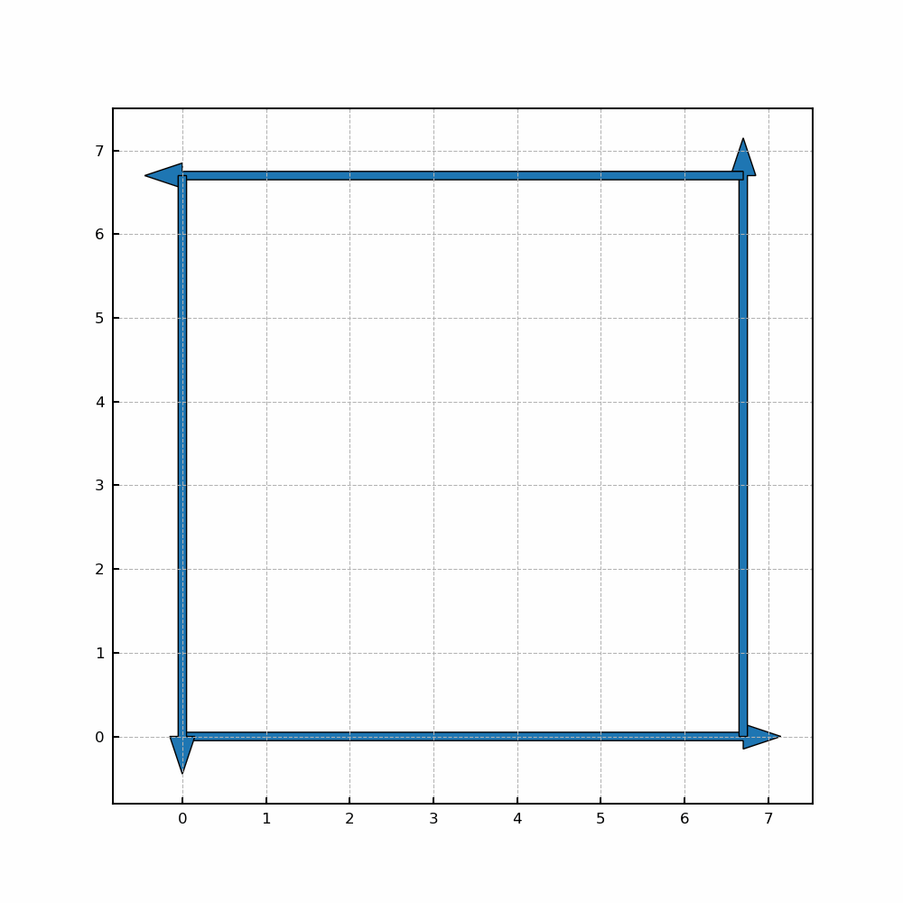
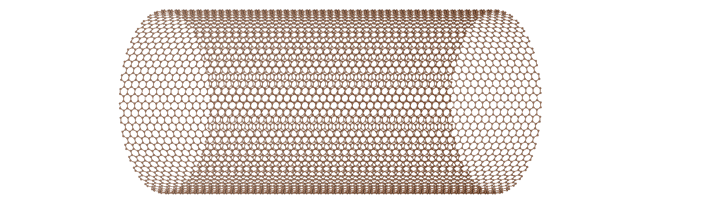

### welcome to my DFT kits: mkits

mkits is a python written tool containing many helpful initial- or post-processing commands for some popular first-principles calculation codes.

## 1. installation

+ install from pip
  ```
  pip install mkits
  ```
  

+ build and install from source
  
  ```
  sudo python3 setup.py bdist_wheel
  pip3 install dist/thebuild.whl
  ```

## 2. New features

+ build quasi-crystalline structures with NGT tiling June 16<sup>rd</sup> 2023
  
  A new class of NGT canvas has been added to builder.py, which can be used to generate different tiling based on provided patterns. A pattern can be defined with a xyz structure file:
  ```
  8
  rhombus
  Sr      0.000000000000000      0.000000000000000      0.570133113075200
  Sr      6.700000001664639      0.000000000000000      0.570133113075200
  Sr     12.502370208508770      3.350000000832320      0.570133113075200
  Sr      5.802370206844132      3.350000000832320      0.570133113075200
  Ti      3.720469533952320      0.811662040359627      0.000000000000000
  Ti      9.000535361468776      2.349738153970408      0.000000000000000
  O       5.085002927088206      1.225916194572862      0.944989785403200
  O       7.634468076562175      2.039944845316493      0.944989785403200

  ```

  Here are three examples of patterns with different shapes (rhombus, square and triangle):

  <p float="left">
    
  </p>

  By using three patterns, a simple tiling from Cockayne-σ model can be plotted and the red dash lines indicate the boder of crystals. 

  <p float="left">
    
    
  </p>

  Then we can try to generate whole NGT tiling and truncate crystals from it:

  <p float="left">
    
  </p>
  
  The next target is try to recognize the target tiling automatically and plot the canvas.

+ nanotube builder May 23<sup>rd</sup> 2023

  <p float="left">
    
  </p>  


 ## 3. available functionals
 
 ```
 mkits: my DFT helper
 |
 |----builder
 |
 |----vasp_init 
 |        |--------param            : additional parameters
 |        |----❀---kgen             : generate odd KPOINTS
 |        |----❀---vasp_gen_input   : generate input files for VASP
 |        |--------dryrun           : generate inputs for VASP, show details
 |        |--------dft              : choose the functional
 |        |--------potpath          : path to directory containing POTCAR
 |        |--------poscar           : specify the structure file
 |        |--------prec             : specify the calculation precision
 |        |--------wpath            : specify the working path
 |        |--------execode          : specify the mpirun code
 |        |----❀---gen2d            : generate 2dimensional structures
 |
 |----vasp_post
 |        |--------param            : additional parameters
 |        |--------fname            : input file name
 |        |----❀---extract_band     : extract eigen value from vasprun.xml
 |        |----❀---extract_dos      : extract total and partial DOS from vasprun.xml
 |        |----❀---structdiff       : check the difference between 2 structures in angstrom
 |        |----❀---extract_conv_test: extract data from convergence test (vasp_init)
 |        |--------wpath            : specify the working path
 |        |----❀---extract_xdatcar  : extract the i-th structure from XDATCAR
 |        |----❀---mse_xdatcar      : calculate the mean squared error
 |
 |----wien_init
 |        |--------fpath            : specify the working directory
 |        |--------fname            : input file name
 |        |--------struct           : input structure name
 |        |--------params           : additional parameters
 |        |----❀---gen_born_struct  : generate input files for BORN effective charge
 |
 |----wien_post
 |
 |----structgen
 |        |--------node_num         : maximum nodes number of the layer
 |        |--------node_type        : trigonal, layered structure
 |        |--------block_num        : give the block number
 |        |--------fix_block        : fix block
 |        |--------block_type       : specify the block
 |        |--------random_kation    : give the kation
 |        |--------random_anion     : give the anion
 |        |--------test_strgen      : do some test
 |
 |----boltz2
 |
 |----critic2
 |        |----❀---extract_gvh      : extract the data from
 |        |--------inp              : input files
 |        |--------out              : specify the name of the output file
 |
 |----fdmnes
 |        |----❀---gen_input        : generate the input file for FDMNES
 |        |--------struct_file      : path to the structure file
 |        |--------fpath            : path to save output files
 |        |--------findex           : specify the index
 |        |--------params           : additional parameters
 ```